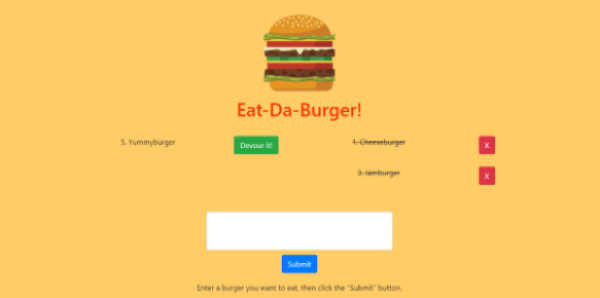

# sequelizedburger
A burger logger created with Sequelize, Node, Express, and hosted on Heroku.  This application started as a 'skeleton code base' which utilized a technology I was unfamiliar with prior to working with this app (handlebars.js) and a "homemade" ORM.  I was challenged to refactor it using Sequelize, which was fairly new to me at the time, in a short timeframe.  Although I chose to refactor the handlebars using jQuery and template literals, I gained an understanding of how handlebars worked in the original code. 

### Developed by: Sarah Kinneer
#### February, 2019

## Technologies Used:
Sequelize, Express.js, Heroku, JavaScript, jQuery, Node.js

## Check Out the Live Site:
- [Link to Live Site](https://boiling-plateau-37335.herokuapp.com/)

## Use:
1. Head to the live site at https://boiling-plateau-37335.herokuapp.com/.
2. You may "eat" an existing burger by clicking "devour", clear a devoured burger from the log by clicking "X", or submit a new burger to the database using the input box.
3. Any changes you or other users make will persist in the database.